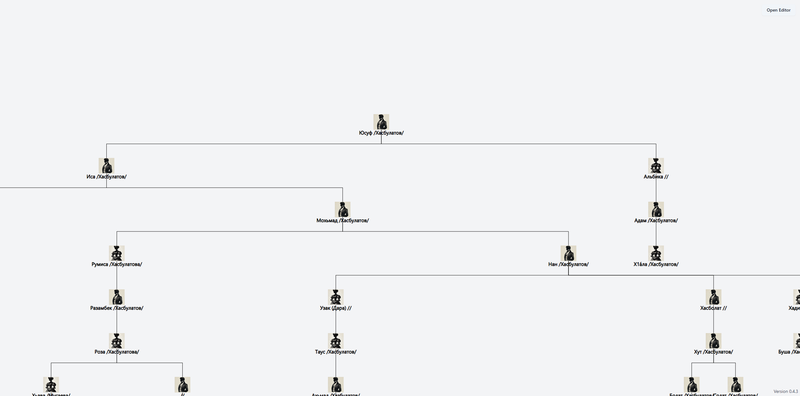

# GEDCOM Family Tree Viewer

## Overview

The GEDCOM Family Tree Viewer is an open-source project created as an alternative to MyHeritage for visualizing family trees. With MyHeritage no longer offering free export options, this tool aims to provide a comparable family tree visualizer and plans to include additional features. The project allows users to view, edit, and export their family tree data directly in the browser, ensuring privacy and security.



The project is built using [React](https://reactjs.org/) for the user interface and [Vite](https://vitejs.dev/) as the build tool, providing a fast and efficient development experience. The user interface components are styled and structured using [shadcn/ui](https://ui.shadcn.com/), offering a modern and customizable design.

## Table of Contents

1. [Overview](#overview)
2. [Features](#features)
3. [Demo](#demo)
4. [Installation](#installation)
5. [Usage](#usage)
6. [Contributing](#contributing)
7. [License](#license)

## Features

- **GEDCOM File Visualization**: Import and visualize GEDCOM files directly in the browser.
- **GEDCOM File Editing** (In Progress): Edit GEDCOM files to manage family tree data.
- **GEDCOM File Export** (In Progress): Export edited family trees for use in other platforms.
- **New Entry Creation** (Planned): Add new family members and details.
- **Family Tree Export as PDF or Image** (Planned): Easily export the family tree to share with others.
- **Customizable Family Tree Layout** (Planned): Adjust tree layout according to personal preferences.

## Demo

Try the live demo [here](https://familytree.khas.app/). Users can upload their GEDCOM files and create visualizations. Everything is processed directly in the browser, ensuring no data is uploaded to any server.

## Installation

1. Clone the repository:
   ```bash
   git clone https://github.com/khashashin/gedcom-viewer.git
   ```
2. Navigate to the project directory:
   ```bash
   cd gedcom-viewer
   ```
3. Install dependencies:
   ```bash
   npm install
   ```
4. Start the project:
   ```bash
   npm run dev
   ```
5. Open the project in a web browser:
   ```
   http://localhost:5173
   ```

## Usage

1. Once the project is running, you can upload your GEDCOM file through the provided interface.
2. Explore and visualize your family tree, using the controls to zoom, pan, and interact with the nodes.
3. Use the editor (when available) to make modifications to individual entries in your family tree.
4. Export your tree in the desired format (GEDCOM, PDF, image) once the features are implemented.

## Contributing

Contributions are welcome! If you would like to contribute, please fork the repository and create a pull request with your proposed changes.

## License

This project is licensed under the **GNU General Public License v3.0**. See the [LICENSE](./LICENSE) file for more details.
